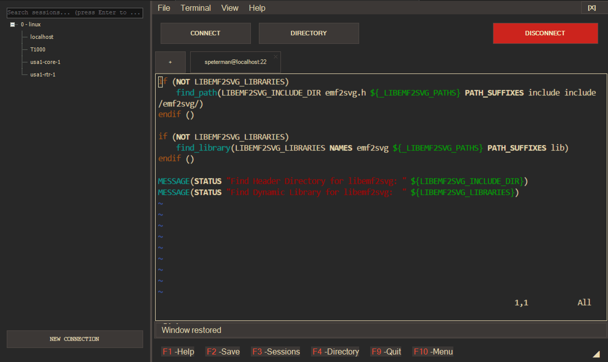

# RetroTerm.NET



A nostalgic terminal emulator with a retro DOS-inspired interface, providing modern SSH connectivity with classic aesthetics.

## Features

- **Authentic Retro DOS Experience**
  - Classic blue interface reminiscent of Borland, Norton Commander, and other DOS applications
  - Function key bar (F1-F10) with hotkeys for quick access to common functions
  - Status bar with double-line borders and title text
  - Tabbed interface for multiple simultaneous connections
  
- **Modern Terminal Capabilities**
  - SSH connectivity using the SSH.NET library
  - Full terminal emulation via xterm.js in WebView2
  - Support for standard terminal features and escape sequences
  - Password and private key authentication options

- **Rich Theming Ecosystem**
  - 4 built-in themes (Borland Classic, Modern Dark, Norton Commander, Classic Light)
  - 20+ additional importable themes including:
    - Classic hardware themes (Amiga, IBM DOS, PC Tools)
    - Retro CRT simulations (Amber, Monochrome)
    - Popular color schemes (Gruvbox, Nord, Solarized)
    - Cyberpunk-inspired themes (Matrix, Cyber, Neon City, Doom)
  - Theme import/export functionality with JSON format
  - Individual color control for all UI elements
  - Terminal colors synchronized with application theme

- **Session Management**
  - Save, organize, and reuse connection profiles
  - Folder-based organization of connections
  - Quick connect from saved sessions
  - Secure password storage

## Easter Eggs

- **Blasteroids**: A classic Asteroids-style game accessible via Terminal → Blasteroids
  - Vector graphics that match your current theme
  - Classic arcade physics and gameplay
  - Play while keeping your terminal sessions active

## Requirements

- Windows 10 or higher
- .NET 6.0 or higher (or use the self-contained build)
- WebView2 Runtime
- Monospace font (Perfect DOS VGA 437 recommended for authentic experience)

## Installation

### Option 1: Pre-built Release
1. Download the latest release from the [Releases](https://github.com/scottpeterman/RetroTerm.NET/releases) page
2. Extract all files to a location of your choice
3. Run RetroTerm.NET.exe

**Note**: Since RetroTerm.NET is not code-signed, Windows may show a SmartScreen warning:
1. Click "More info" when the warning appears
2. Click "Run anyway" to proceed
3. This is normal for open-source applications without expensive code signing certificates

### Option 2: Build from Source
1. Clone the repository:
   ```bash
   git clone https://github.com/scottpeterman/retroterm.net.git
   cd retroterm.net
   ```

2. Build a self-contained single-file executable:
   ```bash
   dotnet publish RetroTerm.NET/RetroTerm.NET.csproj -c Release -r win-x64 --self-contained -p:PublishSingleFile=true
   ```

3. The executable will be created at:
   ```
   RetroTerm.NET/bin/Release/net8.0-windows/win-x64/publish/RetroTerm.NET.exe
   ```

4. Copy the executable to your desired location and run it

**Build Requirements for Source:**
- .NET 8.0 SDK
- Windows 10 or higher
- Visual Studio 2022 or VS Code (optional, for development)

## Getting Started

### Quick Connect

1. Press the "CONNECT" button or use F4 to open the connection dialog
2. Enter your connection details (host, port, username, password)
3. Optionally save the connection for future use
4. Click "Connect" to establish the SSH session

### Using Saved Sessions

1. Press F3 to toggle the Session Navigator panel
2. Navigate through your saved connections
3. Double-click any connection to connect
4. Right-click for additional options

## Architecture

RetroTerm.NET combines modern web technologies with traditional Windows Forms in a layered architecture:

### UI Layer
The outermost layer consists of Windows Forms components styled to look like classic DOS applications:
- Custom-drawn menu bars, function key indicators, and status panels
- Tab control with custom rendering for connection tabs
- Session tree navigator with folder organization

### Terminal Component
The core terminal functionality is provided by the SshTerminalControl component:
- Embeds a WebView2 control that hosts xterm.js for terminal emulation
- Handles communication between the .NET application and the web-based terminal
- Manages SSH connections and data transfer

### Theme Management
The sophisticated theming system allows complete customization of the application's appearance:
- Theme class defines colors for all UI elements and terminal
- ThemeManager handles loading, saving, and applying themes across the application
- Themes can be exported to JSON files and imported from external sources

### Security System
Sensitive data like passwords are protected using modern encryption:
- Master password-based encryption using AES-256
- Key derivation using PBKDF2 with 10,000 iterations
- Automatic migration of plain text passwords to encrypted format

## Advanced Features

### Theming System

RetroTerm.NET's theming is extremely flexible, allowing customization of virtually every visual element:

```
Theme structure:
├── Name, Description, Author, Version
├── UI Colors
│   ├── Background, Text, Border
│   ├── Button colors (normal, connected, disconnected)
│   ├── Menu and status bar colors
│   └── Selection and highlight colors
└── Terminal Colors
    ├── Background, Foreground
    ├── Cursor, Selection
    └── Scrollbar colors
```

#### Available Themes

The application comes with a rich set of themes that cover various aesthetics:

- **Classic Computing**
  - Borland Classic (Turbo Pascal/C inspired)
  - Norton Commander
  - IBM DOS
  - PC Tools
  - Amiga
  - DOS Monochrome
  - Spreadsheet

- **Modern Development**
  - Modern Dark
  - Solarized (Dark & Light)
  - Nord (Dark & Light)
  - Gruvbox (Dark & Light)
  - Peach

- **Retro CRT Simulations**
  - CRT Amber
  - Matrix
  - Cyberpunk (Cyber, Neon City, Doom)

Themes can be easily imported/exported as JSON files, making it simple to share and exchange custom themes with other users.

### xterm.js Integration

RetroTerm.NET leverages the powerful xterm.js library for terminal emulation:

- The terminal is hosted in a WebView2 component with bidirectional communication
- Terminal data is base64-encoded to ensure reliable transfer of all characters
- Terminal resizing is handled dynamically between xterm.js and the SSH connection
- Custom context menus provide standard terminal operations (copy, paste, etc.)

The WebView2 component is initialized with a unique TabID that ensures terminal data is routed correctly in multi-tab scenarios.

### Security Features

Security is a priority in RetroTerm.NET:

- First-time setup creates a master encryption key derived from a user password
- Connection passwords are automatically encrypted using AES-256
- The encryption system uses a key derivation function with salt and multiple iterations
- A verification system ensures the master password is correct

When a password is encrypted:
1. A unique Initialization Vector (IV) is generated
2. The password is encrypted using AES with the derived key and IV
3. The IV is prepended to the encrypted data and stored as Base64

## Keyboard Shortcuts

- **F1**: Help/About
- **F2**: Save (session/settings)
- **F3**: Toggle Sessions Navigator
- **F4**: Open Connection Directory
- **F9**: Quit application
- **F10**: Activate main menu
- **Ctrl+T**: New Tab
- **Ctrl+W**: Close current Tab

## Configuration

RetroTerm.NET stores its data in the following locations:

- **Themes**: `%APPDATA%\RetroTerm.NET\Themes\`
- **Sessions**: `[Application Directory]\sessions\default_sessions.yaml`
- **Settings**: Windows Registry under `HKEY_CURRENT_USER\SOFTWARE\RetroTerm.NET`
- **Security**: `%APPDATA%\RetroTerm.NET\security\encryption.key`

## Customizing Themes

To create your own theme:
1. Use Terminal → Themes → Export Current Theme to save the current theme as a starting point
2. Edit the JSON file with your preferred colors
3. Import the modified theme using Terminal → Themes → Import Theme
4. Your new theme will appear in the themes menu

Sample theme JSON structure:
```json
{
  "Name": "My Custom Theme",
  "Description": "A personalized theme with custom colors",
  "Author": "Your Name",
  "Version": "1.0",
  "BaseTheme": "dark",
  "UI": {
    "Background": "#1A1A1A",
    "Text": "#FFFFFF",
    "ButtonBackground": "#006699",
    "ButtonText": "#FFFFFF",
    ...
  },
  "Terminal": {
    "Background": "#1A1A1A",
    "Foreground": "#CCCCCC",
    "Cursor": "#FFFFFF",
    ...
  }
}
```

## Development

RetroTerm.NET is built with:

- C# / .NET 8.0 (Windows Forms)
- WebView2 for hosting the terminal emulation
- xterm.js for terminal rendering and handling
- SSH.NET for SSH connectivity
- YamlDotNet for configuration file handling

### Building from Source

1. Ensure you have .NET 8.0 SDK installed
2. Clone the repository
3. Build using the command above, or open in Visual Studio and build normally
4. The solution contains multiple projects that are automatically included in the main build

## About

RetroTerm.NET is developed by Scott Peterman © 2025  
GitHub: [github.com/scottpeterman/retroterm.net](https://github.com/scottpeterman/retroterm.net)

---

*CLI's Never Die, They Just Change Their Prompt*

## License

MIT - see License file